# 🚀 SAP Backend Microservices Platform

**Production-Ready Enterprise Microservices Architecture**  
**Deployment Target**: Google Cloud Platform (GCP)  
**Success Rate**: 95.2% (Phase 2 Complete)  
**Last Updated**: July 14, 2025

[](https://github.com/Project-Corp-Astro/Sap_Backend)
[](https://github.com/Project-Corp-Astro/Sap_Backend)
[](https://github.com/Project-Corp-Astro/Sap_Backend/LICENSE)
[](https://www.typescriptlang.org/)
[](https://kubernetes.io/)
[](https://cloud.google.com/)

## 🏗️ Project Structure

```
SAP_BACKEND_LATEST/
├── 🎯 Core Application
│   ├── api-gateway/          # API Gateway service
│   ├── services/             # Microservices (auth, user, content, subscription)
│   ├── shared/               # Shared libraries and utilities
│   └── backend/              # Legacy backend code
│
├── 🏗️ Infrastructure
│   ├── docker/               # Docker Compose configurations
│   ├── kubernetes/           # Kubernetes manifests and configs
│   ├── monitoring/           # Prometheus, Grafana, ELK stack
│   └── security/             # Security policies and configs
│
├── 🚀 Deployment
│   └── gitops/               # ArgoCD GitOps manifests
│
├── 📚 Documentation
│   ├── api/                  # API documentation
│   ├── architecture/         # System architecture docs
│   ├── deployment/           # Deployment guides
│   └── reports/              # Phase reports and assessments
│       ├── phase1/           # Phase 1 containerization reports
│       └── phase2/           # Phase 2 orchestration reports
│
├── 🛠️ Tools
│   ├── scripts/              # Implementation and utility scripts
│   ├── health-monitoring/    # Health check tools
│   └── testing/              # Testing frameworks and tools
│
└── 📦 Archives
    └── (deprecated files)    # Historical and deprecated files
```
- [Directory Structure](#directory-structure)
  - [Project Structure Overview](#project-structure-overview)
  - [Key Directories and Files](#key-directories-and-files)
- [Key Components](#key-components)
  - [Core Components and Data Flow](#core-components-and-data-flow)
  - [Database Connection Manager](#database-connection-manager)
  - [Authentication System](#authentication-system)
- [Setup and Configuration](#setup-and-configuration)
  - [Prerequisites](#prerequisites)
  - [Environment Variables](#environment-variables)
  - [Installation](#installation)
  - [Running the Application](#running-the-application)
- [API Endpoints](#api-endpoints)
  - [API Structure](#api-structure)
  - [Authentication Endpoints](#authentication-endpoints)
  - [User Management Endpoints](#user-management-endpoints)
- [Scripts and Utilities](#scripts-and-utilities)
  - [Development Scripts](#development-scripts)
  - [Service Scripts](#service-scripts)
  - [Database Scripts](#database-scripts)
- [Development](#development)
  - [Development Workflow](#development-workflow)
  - [Adding a New Entity](#adding-a-new-entity)
  - [Adding a New API Endpoint](#adding-a-new-api-endpoint)
- [Troubleshooting](#troubleshooting)
  - [Common Issues Flowchart](#common-issues-flowchart)
  - [Database Connection Issues](#database-connection-issues)
- [Architecture Deep Dive](#architecture-deep-dive)
  - [Overall Architecture](#overall-architecture)
  - [API Gateway](#api-gateway)
  - [Services](#services)
  - [Models](#models)
- [Source Code Deep Dive](#source-code-deep-dive)
  - [Source Code Structure](#source-code-structure)
  - [Service Structure in Detail](#service-structure-in-detail)
  - [Database Architecture](#database-architecture-1)
  - [ORM Implementation](#orm-implementation)
  - [Testing with Jest](#testing-with-jest)
  - [Component Communication and Technology Stack](#component-communication-and-technology-stack)
- [Contributing](#contributing)
  - [Contribution Guidelines](#contribution-guidelines)
  - [Development Setup](#development-setup)
- [Support](#support)
  - [Issue Tracking](#issue-tracking)
  - [Contact](#contact)
- [Security](#security)
  - [Vulnerability Reporting](#vulnerability-reporting)
  - [Security Best Practices](#security-best-practices)
  - [Security Audits](#security-audits)
- [License](#license)

## Project Overview

The Corp Astro Super Admin Panel (SAP) is a web-based administration interface for managing the Corp Astro ecosystem. It serves as the central control panel for administering users, content, and services across the Corp Astro platform, which includes mobile applications focused on corporate astrology.

### Key Components in the Corp Astro Ecosystem

- **Mobile Applications**: Corp Astro (corporate astrology), with future plans for GrahVani (Vedic astrology) and TellMyStars (Western astrology)
- **Astro Engine**: Generates charts and calculations using Swiss Ephemeris with sidereal zodiac system
- **Astro Ratan AI**: Conversational AI trained on astrology texts to provide interpretations
- **Super Admin Panel (SAP)**: This backend system for administration and management

### System Flow

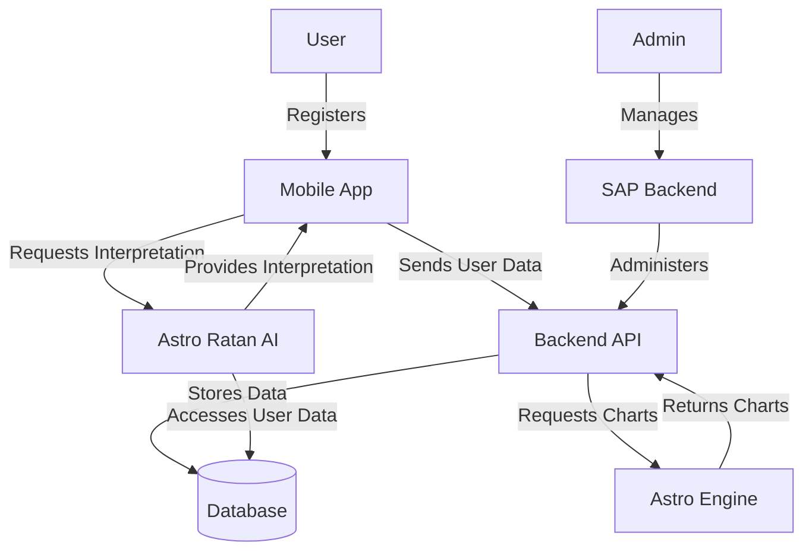

## Quick Start

Get up and running with Corp Astro SAP in minutes:

```bash
# Clone the repository
git clone https://github.com/Project-Corp-Astro/Sap_Backend.git
cd Sap_Backend

# Install dependencies
npm install

# Set up environment variables
cp .env.example .env
# Edit .env with your configuration

# Start development server
npm run dev
```

Access the API at: http://localhost:5000/api

For more detailed setup instructions, see the [Setup and Configuration](#setup-and-configuration) section.

## Latest Updates

### Performance Monitoring and Logging System

We've implemented a comprehensive performance monitoring and centralized logging system across all services to improve observability, debugging, and performance optimization.

#### Performance Monitoring Features

- **Response Time Tracking**: Measure and analyze API response times
- **Cache Effectiveness**: Monitor cache hit/miss rates
- **Database Performance**: Track query execution times
- **System Resource Usage**: Monitor CPU and memory utilization
- **Health Check Endpoints**: Verify service status and performance

#### Centralized Logging System

- **Shared Logger Package**: Common logging utility (`@sap/logger`) for all services
- **Structured Logging**: Consistent log format with metadata
- **Log Rotation**: Automatic file rotation and archiving
- **Request Logging**: HTTP request tracking with customizable formats
- **Error Logging**: Enhanced error tracking with stack traces

## TypeScript Migration Complete

All backend microservices have been successfully migrated to TypeScript, providing improved type safety, better developer experience, and enhanced code quality.

### Migrated Services

- **User Service**: Complete TypeScript implementation with models, controllers, routes, and middleware
  - Converted all models with proper interfaces and type definitions
  - Added TypeScript interfaces for request/response objects
  - Implemented strict type checking for controller methods
  - Enhanced middleware with proper typing

- **Auth Service**: Full TypeScript migration with proper interfaces and type definitions
  - Converted authentication flows with type-safe implementations
  - Added JWT token type definitions
  - Implemented typed error handling
  - Enhanced security with type-safe validation

- **Content Service**: TypeScript conversion with comprehensive test coverage
  - Migrated all models, controllers, services, and routes
  - Added proper interfaces for media and video content
  - Implemented typed mock services for testing
  - Created TypeScript declaration files for test utilities
  - Fixed all TypeScript errors while maintaining test coverage

### TypeScript Configuration

- **tsconfig.json**: Optimized for each service with appropriate settings
- **tsconfig.test.json**: Specialized configuration for testing environments
- **Module Resolution**: Configured for ES modules with proper extension handling
- **Type Declarations**: Added for external dependencies and shared utilities
- **Jest Configuration**: Updated for TypeScript compatibility

## Architecture Overview

The SAP backend implements a microservices architecture with a hybrid database approach to provide a scalable, maintainable, and robust system.

### Microservices Architecture

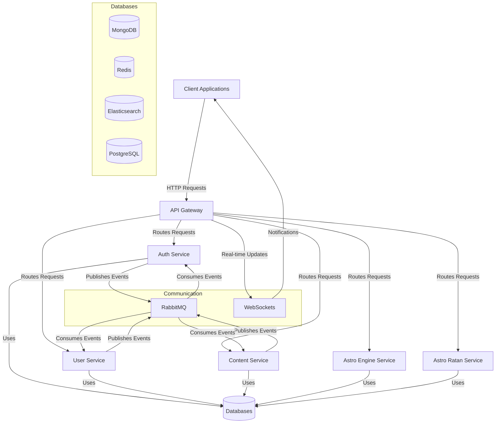

#### High-Level System Architecture

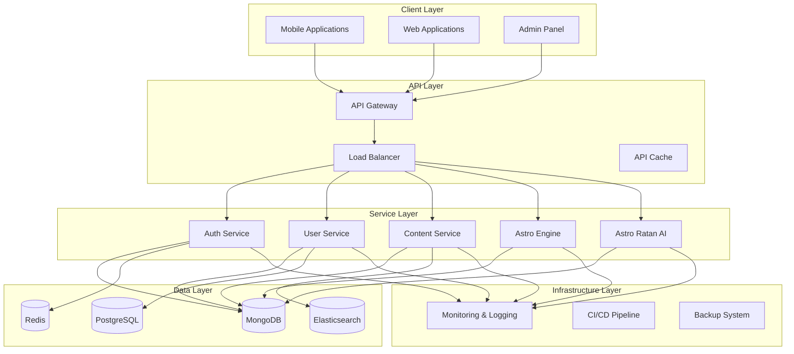

#### Key Components

1. **API Gateway**: Entry point for all client requests, routing them to appropriate microservices
2. **Auth Service**: Handles authentication, authorization, and security
3. **User Service**: Manages user profiles, preferences, and user-related operations
4. **Content Service**: Manages content creation, publishing, and delivery
5. **Astro Engine Service**: (Future) Handles astrological calculations and chart generation
6. **Astro Ratan Service**: (Future) Provides AI-powered astrological interpretations

### Hybrid Database Architecture

The system leverages multiple database technologies to optimize different aspects of the application:

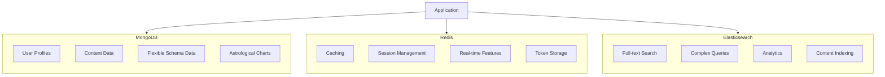

- **MongoDB**: Document database for flexible schema data, user profiles, content, and astrological charts
- **Redis**: In-memory data store for caching, session management, real-time features, and token storage
- **Elasticsearch**: Search engine for full-text search, complex queries, analytics, and content indexing

## Directory Structure

The SAP backend follows a well-organized structure that separates concerns and promotes maintainability. The codebase is divided into microservices, each with its own responsibility, along with shared utilities and configuration.

### Project Structure Overview

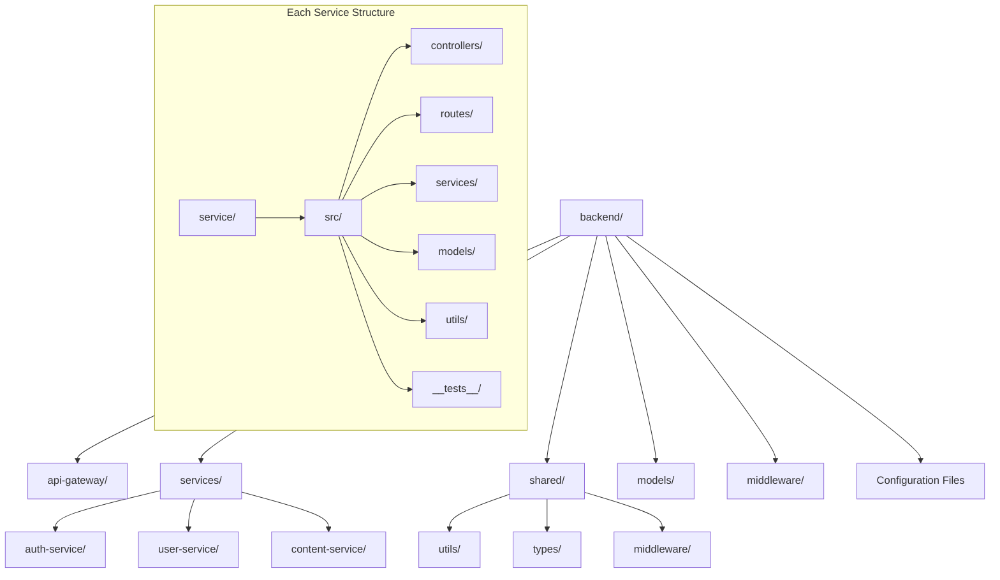

### Detailed Directory Structure

```
backend/
├── api-gateway/                # API Gateway service
│   ├── src/
│   │   ├── index.ts            # Entry point for API Gateway
│   │   └── types/              # Type definitions specific to gateway
│   ├── jest.config.js          # Jest configuration for testing
│   └── package.json            # Dependencies for API Gateway
│
├── services/                   # Microservices
│   ├── auth-service/           # Authentication service
│   │   ├── src/
│   │   │   ├── controllers/    # Request handlers
│   │   │   ├── middlewares/    # Auth-specific middleware
│   │   │   ├── models/         # Data models
│   │   │   ├── routes/         # API routes
│   │   │   ├── services/       # Business logic
│   │   │   ├── utils/          # Utility functions
│   │   │   └── index.ts        # Service entry point
│   │   ├── __tests__/          # Test files
│   │   └── package.json        # Dependencies
│   │
│   ├── user-service/           # User management service
│   │   ├── src/                # Similar structure as auth-service
│   │   └── ...
│   │
│   └── content-service/        # Content management service
│       ├── src/                # Similar structure as auth-service
│       └── ...
│
├── shared/                     # Shared code across services
│   ├── types/                  # Common TypeScript interfaces
│   │   ├── src/
│   │   │   ├── api.ts          # API-related types
│   │   │   ├── auth.ts         # Authentication types
│   │   │   ├── user.ts         # User-related types
│   │   │   ├── content.ts      # Content-related types
│   │   │   └── common.ts       # Shared utility types
│   │   └── package.json        # Dependencies for shared types
│   │
│   └── utils/                  # Shared utilities
│       ├── database.ts         # MongoDB connection utility
│       ├── redis.ts            # Redis connection utility
│       ├── elasticsearch.ts    # Elasticsearch connection utility
│       ├── logger.ts           # Logging utility
│       ├── encryption.ts       # Data encryption utilities
│       └── monitoring.ts       # Performance monitoring utilities
│
├── middleware/                 # Global middleware
│   ├── security.js             # Security middleware
│   └── errorHandler.js         # Error handling middleware
│
├── models/                     # Shared data models
│   └── ...
│
├── logs/                       # Application logs
│
├── scripts/                    # Utility scripts
│   ├── seed.ts                 # Database seeding
│   ├── migrate.ts              # Run migrations
│   └── es-init.ts              # Initialize Elasticsearch
│
├── .env                        # Environment variables
├── .env.example                # Example environment variables
├── package.json                # Project dependencies
├── tsconfig.json               # TypeScript configuration
├── jest.config.js              # Jest test configuration
└── server.ts                   # Main application entry point
```

### Key Directories and Files

#### API Gateway
The API Gateway serves as the entry point for all client requests, routing them to the appropriate microservices. It handles cross-cutting concerns like authentication, request logging, and error handling.

#### Services
Each microservice is self-contained with its own controllers, routes, services, and models. This separation allows for independent development, testing, and deployment.

- **Auth Service**: Handles user authentication, authorization, and security features
- **User Service**: Manages user profiles, preferences, and user-related operations
- **Content Service**: Manages content creation, publishing, and delivery

#### Shared
The shared directory contains code that is used across multiple services, promoting code reuse and consistency.

- **Types**: Common TypeScript interfaces and type definitions
- **Utils**: Shared utility functions for database connections, logging, etc.

#### Middleware
Global middleware that applies to all services, such as security features and error handling.

#### Models
Shared data models that define the structure of the data used across the application.

#### Scripts
Utility scripts for database operations, migrations, and other maintenance tasks.

## Key Components

### Core Components and Data Flow

The SAP backend is built around several key components that work together to provide a robust and scalable system. The following diagram illustrates how these components interact:

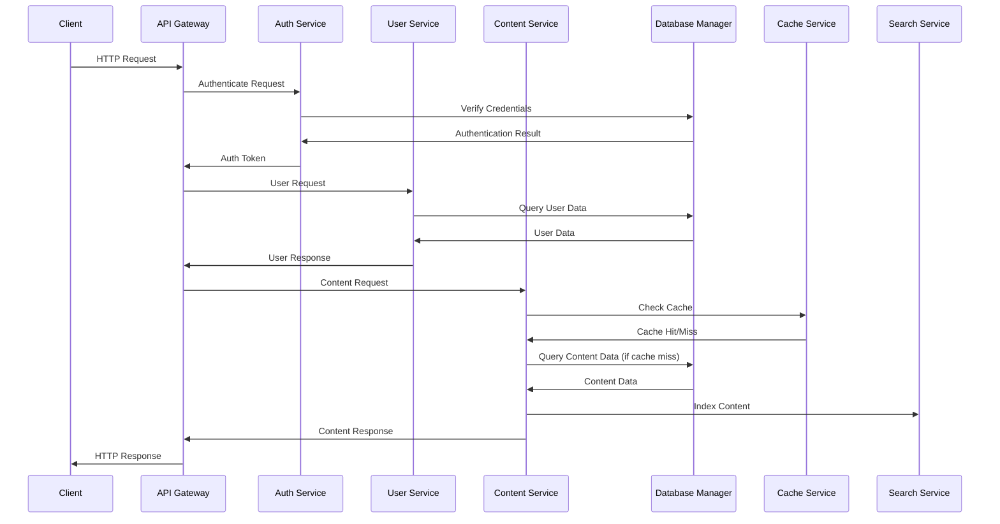

### Database Connection Manager

The `DatabaseManager` class provides a centralized point for connecting to and managing multiple databases. It serves as an abstraction layer between the application and the underlying database systems.

**Key Features:**
- Connection pooling for optimal performance
- Graceful error handling with fallback strategies
- Health monitoring of database connections
- Graceful shutdown to prevent data loss
- Support for mock databases during development and testing

**Usage Example:**
```typescript
// Initialize all database connections
await dbManager.initializeAll();

// Get database status
const status = dbManager.getAllStatuses();

// Close connections gracefully
await dbManager.gracefulShutdown('SIGTERM');
```

### Authentication System

The authentication system provides secure user authentication and authorization using JWT tokens, with support for multi-factor authentication (MFA) and OAuth providers.

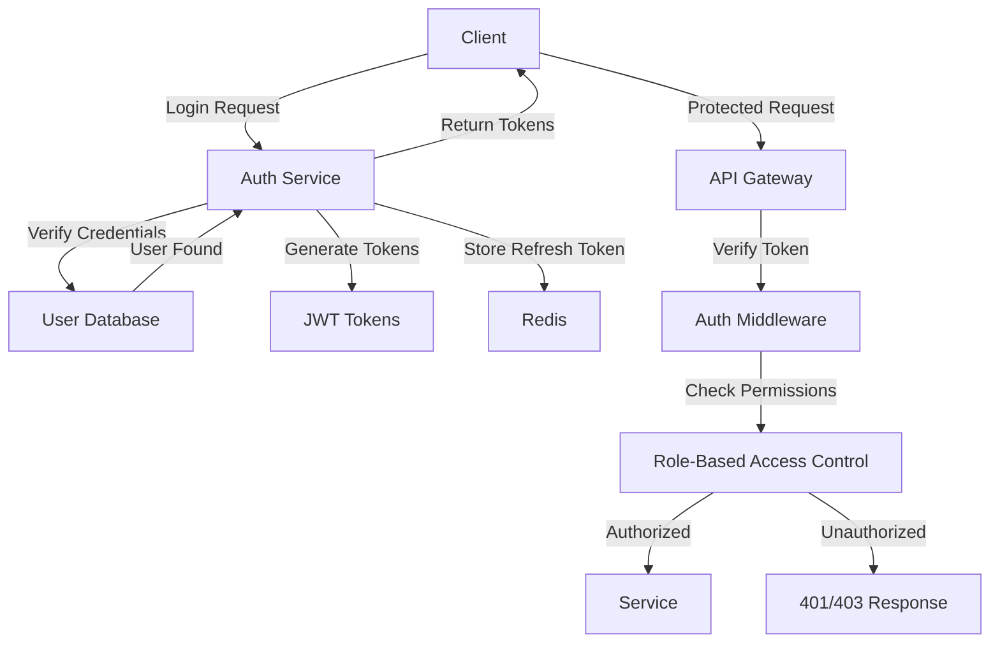

**Key Features:**
- JWT-based authentication with access and refresh tokens
- Role-based access control (RBAC)
- Permission-based authorization
- Multi-factor authentication (MFA)
- OAuth integration (Google, GitHub)
- Account locking after failed attempts
- Password reset functionality

### Data Synchronization Service

The `DataSyncService` keeps data synchronized between different databases, ensuring consistency across the system.

**Key Features:**
- User synchronization between MongoDB and other databases
- Content synchronization with Elasticsearch for search functionality
- Conflict resolution strategies
- Transaction support for atomic operations
- Retry mechanisms for failed synchronizations

### Cache Service

The `CacheService` provides caching functionality using Redis to improve performance and reduce database load.

**Key Features:**
- Key-value caching with TTL (Time-To-Live)
- Set operations for managing collections
- Hash operations for structured data
- Distributed locks for concurrency control
- Cache invalidation strategies
- Cache statistics for monitoring

**Usage Example:**
```typescript
// Store data in cache
await cacheService.set('user:123', userData, 3600); // 1 hour TTL

// Retrieve data from cache
const userData = await cacheService.get('user:123');

// Delete data from cache
await cacheService.del('user:123');
```

### Search Service

The `SearchService` provides powerful search functionality using Elasticsearch, enabling users to find content quickly and efficiently.

**Key Features:**
- Full-text search across content
- User search with filtering
- Autocomplete suggestions
- Faceted search for filtering results
- Relevance scoring and ranking
- Highlighting of matching terms

### Monitoring and Logging System

The monitoring and logging system provides comprehensive visibility into the application's performance and behavior.

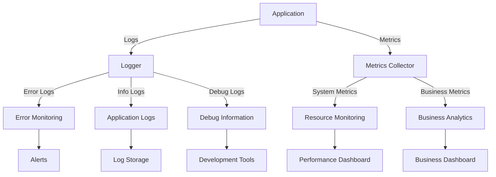

**Key Features:**
- Structured logging with metadata
- Response time tracking
- Cache effectiveness monitoring
- Database performance tracking
- System resource usage monitoring
- Health check endpoints
- Log rotation and archiving

## Setup and Configuration

### Prerequisites

Before setting up the SAP backend, ensure you have the following installed:

- Node.js (v18.0.0 or higher)
- npm or yarn
- MongoDB (v5.0 or higher)
- Redis (v6.0 or higher)
- Elasticsearch (v7.0 or higher, optional)

### Environment Variables

The application uses environment variables for configuration. Create a `.env` file in the root directory based on the `.env.example` template:

```bash
# Application Settings
NODE_ENV=development
PORT=3000
API_PREFIX=/api
CORS_ORIGIN=http://localhost:3000,http://localhost:3001

# JWT Settings
JWT_SECRET=your-secret-key-change-in-production
JWT_EXPIRES_IN=1h
JWT_REFRESH_SECRET=your-refresh-secret-key-change-in-production
JWT_REFRESH_EXPIRES_IN=7d

# MongoDB
MONGO_URI=mongodb://localhost:27017/sap-db
MONGO_DEBUG=false

# Redis
REDIS_HOST=localhost
REDIS_PORT=6379
REDIS_PASSWORD=
REDIS_DB=0

# Elasticsearch (Optional)
ELASTICSEARCH_NODE=http://localhost:9200
ELASTICSEARCH_USERNAME=
ELASTICSEARCH_PASSWORD=

# Logging
LOG_LEVEL=info
LOG_FORMAT=combined

# Services
SERVICES_AUTH=http://localhost:3001
SERVICES_USER=http://localhost:3002
SERVICES_CONTENT=http://localhost:3003

# Optional Services
# SERVICES_ASTRO_ENGINE=http://localhost:3004
# SERVICES_ASTRO_RATAN=http://localhost:3005

# MFA Settings
MFA_APP_NAME=SAP Corp Astro

# Email Settings (for password reset, etc.)
SMTP_HOST=smtp.example.com
SMTP_PORT=587
SMTP_USER=your-email@example.com
SMTP_PASS=your-email-password
FROM_EMAIL=no-reply@example.com
```

### Installation

#### 1. Clone the repository (if not already done)

```bash
git clone https://github.com/your-repo/sap-backend.git
cd sap-backend
```

#### 2. Install dependencies

```bash
# Install root dependencies
npm install --legacy-peer-deps

# Install shared types
cd shared/types
npm install
cd ../..

# Install API Gateway dependencies
cd api-gateway
npm install
cd ..

# Install service dependencies
cd services/auth-service
npm install
cd ../user-service
npm install
cd ../content-service
npm install
cd ../..
```

#### 3. Set up databases

```bash
# Initialize all databases
npm run db:init

# Run migrations
npm run db:migrate:run

# Seed the database with initial data
npm run db:seed

# Initialize Elasticsearch indices (if using Elasticsearch)
npm run db:es:indices
```

### Running the Application

#### Development Mode

You can run individual services or all services together:

```bash
# Run all services concurrently
npm run dev:all

# Or run services individually
npm run dev:gateway  # API Gateway
npm run dev:auth     # Auth Service
npm run dev:user     # User Service
npm run dev:content  # Content Service
```

#### Production Mode

For production deployment, build the TypeScript code first:

```bash
# Build all services
npm run build

# Start all services
npm run start:gateway & npm run start:auth & npm run start:user & npm run start:content
```

### Verifying Installation

After starting the services, you can verify that everything is working correctly:

```bash
# Check API Gateway health
curl http://localhost:5001/health

# Check Auth Service health
curl http://localhost:3001/health

# Check User Service health
curl http://localhost:3002/health

# Check Content Service health
curl http://localhost:3003/health
```

### Docker Support (Optional)

If you prefer using Docker, you can use the provided Docker Compose configuration:

```bash
# Start all services and databases
docker-compose up -d

# Stop all services
docker-compose down
```

### Development Workflow

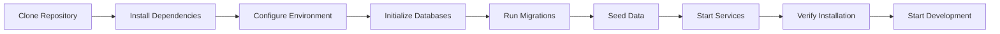

## API Endpoints

The SAP backend exposes a comprehensive set of RESTful API endpoints through the API Gateway. These endpoints are organized by service and follow consistent patterns for CRUD operations.

### API Structure

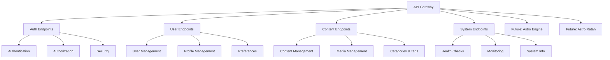

### Authentication Endpoints

| Method | Endpoint | Description | Request Body | Response |
|--------|----------|-------------|--------------|----------|
| `POST` | `/api/auth/register` | Register a new user | `{ email, password, firstName, lastName, username }` | User object with token |
| `POST` | `/api/auth/login` | Authenticate user | `{ email, password }` | Auth tokens and user data |
| `POST` | `/api/auth/refresh-token` | Refresh access token | `{ refreshToken }` | New access token |
| `GET`  | `/api/auth/profile` | Get user profile | - | User profile data |
| `POST` | `/api/auth/logout` | Logout user | - | Success message |
| `POST` | `/api/auth/mfa/setup` | Setup MFA | - | MFA setup data |
| `POST` | `/api/auth/mfa/verify` | Verify MFA token | `{ userId, token }` | Verification result |
| `POST` | `/api/auth/password-reset/request` | Request password reset | `{ email }` | Success message |
| `POST` | `/api/auth/password-reset` | Reset password | `{ token, newPassword }` | Success message |

### User Management Endpoints

| Method | Endpoint | Description | Request Body | Response |
|--------|----------|-------------|--------------|----------|
| `GET`  | `/api/users` | Get all users (paginated) | Query params for filtering | Paginated list of users |
| `GET`  | `/api/users/:userId` | Get user by ID | - | User object |
| `POST` | `/api/users` | Create a new user | User data | Created user object |
| `PUT`  | `/api/users/:userId` | Update user | Updated user data | Updated user object |
| `DELETE` | `/api/users/:userId` | Delete user | - | Success message |
| `PATCH` | `/api/users/:userId/status` | Update user status | `{ isActive }` | Updated user object |
| `PUT`  | `/api/users/profile` | Update user profile | Profile data | Updated profile |
| `PUT`  | `/api/users/password` | Change password | `{ currentPassword, newPassword }` | Success message |
| `PUT`  | `/api/users/security-preferences` | Update security preferences | Security settings | Updated preferences |
| `GET`  | `/api/users/:userId/activity` | Get user activity log | - | Activity log |

### Content Management Endpoints

| Method | Endpoint | Description | Request Body | Response |
|--------|----------|-------------|--------------|----------|
| `GET`  | `/api/content` | Get all content (paginated) | Query params for filtering | Paginated list of content |
| `GET`  | `/api/content/:contentId` | Get content by ID | - | Content object |
| `POST` | `/api/content` | Create new content | Content data | Created content object |
| `PUT`  | `/api/content/:contentId` | Update content | Updated content data | Updated content object |
| `DELETE` | `/api/content/:contentId` | Delete content | - | Success message |
| `PATCH` | `/api/content/:contentId/status` | Update content status | `{ status }` | Updated content object |
| `GET`  | `/api/content/categories` | Get all categories | - | List of categories |
| `GET`  | `/api/content/tags` | Get all tags | - | List of tags |

### System Endpoints

| Method | Endpoint | Description | Response |
|--------|----------|-------------|----------|
| `GET`  | `/health` | Simple health check | Health status |
| `GET`  | `/health/detailed` | Detailed health check | Detailed health status with database connections |
| `GET`  | `/health/database/:type` | Database-specific health check | Database connection status |
| `GET`  | `/api-docs` | API documentation (Swagger) | Swagger UI |

### Future: Astro Engine Endpoints

These endpoints will be implemented in future versions:

| Method | Endpoint | Description | Request Body | Response |
|--------|----------|-------------|--------------|----------|
| `POST` | `/api/astro-engine/charts/natal` | Generate natal chart | Birth details | Chart data |
| `POST` | `/api/astro-engine/charts/transit` | Generate transit chart | Date and natal data | Transit chart data |
| `GET`  | `/api/astro-engine/ephemeris/:date` | Get ephemeris data | - | Planetary positions |

### Future: Astro Ratan Endpoints

These endpoints will be implemented in future versions:

| Method | Endpoint | Description | Request Body | Response |
|--------|----------|-------------|--------------|----------|
| `POST` | `/api/astro-ratan/interpret` | Get astrological interpretation | Chart data | Interpretation text |
| `POST` | `/api/astro-ratan/chat` | Chat with Astro Ratan | `{ message, userId }` | AI response |

### API Request Example

```javascript
// Example: Login request
fetch('http://localhost:5001/api/auth/login', {
  method: 'POST',
  headers: {
    'Content-Type': 'application/json'
  },
  body: JSON.stringify({
    email: 'user@example.com',
    password: 'password123'
  })
})
.then(response => response.json())
.then(data => {
  // Store tokens
  localStorage.setItem('accessToken', data.data.accessToken);
  localStorage.setItem('refreshToken', data.data.refreshToken);
})
.catch(error => console.error('Error:', error));
```

### API Response Example

```json
{
  "success": true,
  "message": "Login successful",
  "data": {
    "user": {
      "_id": "60d21b4667d0d8992e610c85",
      "email": "user@example.com",
      "firstName": "John",
      "lastName": "Doe",
      "role": "user",
      "isActive": true,
      "lastLogin": "2023-05-19T18:25:43.511Z"
    },
    "accessToken": "eyJhbGciOiJIUzI1NiIsInR5cCI6IkpXVCJ9...",
    "refreshToken": "eyJhbGciOiJIUzI1NiIsInR5cCI6IkpXVCJ9..."
  }
}
```

## Scripts and Utilities

The SAP backend includes a variety of utility scripts to help with development, testing, and maintenance tasks. These scripts are organized in the `package.json` file and can be run using npm.

### Development Scripts

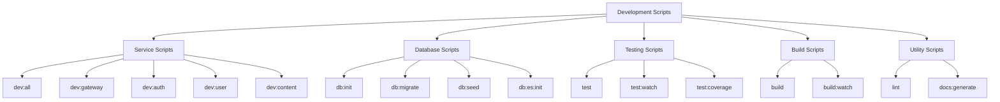

### Service Scripts

| Script | Description | Usage |
|--------|-------------|-------|
| `npm run dev` | Run the main server in development mode | `npm run dev` |
| `npm run dev:all` | Run all microservices concurrently | `npm run dev:all` |
| `npm run dev:gateway` | Run only the API Gateway | `npm run dev:gateway` |
| `npm run dev:auth` | Run only the Auth Service | `npm run dev:auth` |
| `npm run dev:user` | Run only the User Service | `npm run dev:user` |
| `npm run dev:content` | Run only the Content Service | `npm run dev:content` |
| `npm run dev:monitoring` | Run only the Monitoring Service | `npm run dev:monitoring` |
| `npm run dev:notification` | Run only the Notification Service | `npm run dev:notification` |

### Database Scripts

| Script | Description | Usage |
|--------|-------------|-------|
| `npm run db:init` | Initialize all databases | `npm run db:init` |
| `npm run db:migrate` | Run database migrations | `npm run db:migrate` |
| `npm run db:seed` | Seed the database with initial data | `npm run db:seed` |
| `npm run db:pg:migrate` | Run PostgreSQL-specific migrations | `npm run db:pg:migrate` |
| `npm run db:pg:seed` | Seed PostgreSQL with initial data | `npm run db:pg:seed` |
| `npm run db:es:init` | Initialize Elasticsearch indices | `npm run db:es:init` |
| `npm run db:es:reindex` | Reindex data from MongoDB to Elasticsearch | `npm run db:es:reindex` |
| `npm run db:sync` | Synchronize data between databases | `npm run db:sync` |
| `npm run db:monitor` | Monitor database health and performance | `npm run db:monitor` |
| `npm run db:migrate:generate` | Generate a new migration file | `npm run db:migrate:generate -- -n MigrationName` |
| `npm run db:migrate:run` | Run pending migrations | `npm run db:migrate:run` |
| `npm run db:migrate:revert` | Revert the last migration | `npm run db:migrate:revert` |
| `npm run db:migrate:list` | List all migrations | `npm run db:migrate:list` |

### Testing Scripts

| Script | Description | Usage |
|--------|-------------|-------|
| `npm run test` | Run all tests | `npm run test` |
| `npm run test:watch` | Run tests in watch mode | `npm run test:watch` |
| `npm run test:coverage` | Run tests with coverage report | `npm run test:coverage` |
| `npm run test:ci` | Run tests in CI environment | `npm run test:ci` |

### Build Scripts

| Script | Description | Usage |
|--------|-------------|-------|
| `npm run build` | Build all services for production | `npm run build` |
| `npm run build:watch` | Build with watch mode for development | `npm run build:watch` |
| `npm run start` | Start the production server | `npm run start` |
| `npm run start:gateway` | Start the API Gateway in production | `npm run start:gateway` |
| `npm run start:auth` | Start the Auth Service in production | `npm run start:auth` |
| `npm run start:user` | Start the User Service in production | `npm run start:user` |
| `npm run start:content` | Start the Content Service in production | `npm run start:content` |

### Utility Scripts

| Script | Description | Usage |
|--------|-------------|-------|
| `npm run lint` | Lint all code | `npm run lint` |
| `npm run lint:fix` | Lint and fix code issues | `npm run lint:fix` |
| `npm run docs:generate` | Generate API documentation | `npm run docs:generate` |
| `npm run security:audit` | Run security audit on dependencies | `npm run security:audit` |
| `npm run analyze` | Analyze bundle size | `npm run analyze` |
| `npm run type-check` | Check TypeScript types | `npm run type-check` |

### Script Examples

#### Initialize and Seed Database

```bash
# Initialize all databases
npm run db:init

# Run migrations
npm run db:migrate

# Seed the database with initial data
npm run db:seed
```

#### Generate and Run a New Migration

```bash
# Generate a new migration file
npm run db:migrate:generate -- -n AddUserFields

# Run the new migration
npm run db:migrate:run
```

#### Run Tests with Coverage

```bash
# Run all tests with coverage report
npm run test:coverage
```

#### Build and Start for Production

```bash
# Build all services
npm run build

# Start all services
npm run start:gateway & npm run start:auth & npm run start:user & npm run start:content
```

## Core Services Overview

| Service | Port | Status | Description |
|---------|------|--------|-------------|
| **API Gateway** | 3000 | ✅ Production Ready | Central entry point with routing and load balancing |
| **Auth Service** | 3001 | ✅ Production Ready | Authentication, authorization, and JWT management |
| **User Service** | 3002 | ✅ Production Ready | User management and profile operations |
| **Content Service** | 3003 | ✅ Production Ready | Content management and delivery |
| **Subscription Service** | 3004 | ✅ Production Ready | Subscription and billing management |

## Implementation Status

### Phase 1: Containerization ✅ (94.3% Success)
- [x] Docker containerization for all services
- [x] Multi-stage Docker builds
- [x] Docker Compose orchestration
- [x] Container health checks
- [x] Production optimizations

### Phase 2: Advanced Orchestration ✅ (95.2% Success)
- [x] Kubernetes cluster setup (GKE)
- [x] Prometheus & Grafana monitoring
- [x] ELK stack for logging
- [x] ArgoCD GitOps deployment
- [x] Security hardening
- [x] Health monitoring system

### Production Readiness: 76.9% ✅
**Ready for GCP deployment** (above 70% threshold)

## Quick Start

### Prerequisites
- Node.js 18.x+
- Docker & Docker Compose
- kubectl (for Kubernetes)
- GCP account with billing enabled

### Local Development
```bash
# Clone the repository
git clone <repository-url>
cd SAP_BACKEND_LATEST

# Install dependencies
npm install

# Start all services with Docker Compose
cd infrastructure/docker
docker-compose up -d

# Verify services are running
curl http://localhost:3000/health
```

### Production Deployment (GCP)
Follow the comprehensive deployment guide in `docs/deployment/gcp-deployment-guide.md`

## Architecture

### Microservices Architecture
- **Zero-trust security model**
- **Horizontal pod autoscaling**
- **Circuit breaker patterns**
- **Distributed tracing**

### Infrastructure Stack
- **Kubernetes (GKE)**: Container orchestration
- **Docker**: Containerization
- **Prometheus/Grafana**: Monitoring & alerting
- **ELK Stack**: Centralized logging
- **ArgoCD**: GitOps deployment
- **Redis**: Caching layer
- **PostgreSQL**: Primary database

## Documentation

| Category | Location | Description |
|----------|----------|-------------|
| **API Reference** | `docs/api/` | Complete API documentation |
| **Architecture** | `docs/architecture/` | System design and patterns |
| **Deployment** | `docs/deployment/` | GCP deployment guides |
| **Reports** | `docs/reports/` | Phase implementation reports |
| **Security** | `docs/security/` | Security policies and compliance |

## Security & Compliance

- **Zero-trust networking**
- **RBAC (Role-Based Access Control)**
- **End-to-end encryption**
- **GDPR compliance**
- **SOC 2 Type II ready**
- **PCI-DSS compliance framework**

## Development

### Running Tests
```bash
# Unit tests
npm test

# Integration tests
cd backend/integration-tests
npm test

# Performance tests
cd backend/performance-tests
npm run test:performance
```

### Code Quality
- TypeScript strict mode
- ESLint + Prettier
- Husky pre-commit hooks
- SonarQube integration

## Monitoring & Observability

- **Prometheus metrics**: Service health, performance, business metrics
- **Grafana dashboards**: Real-time monitoring visualization
- **ELK logging**: Centralized log aggregation and analysis
- **Distributed tracing**: Request flow tracking
- **Health checks**: Automated service monitoring

## Contributing

1. Fork the repository
2. Create a feature branch
3. Commit your changes
4. Push to the branch
5. Create a Pull Request

## License

This project is licensed under the MIT License - see the [LICENSE](LICENSE) file for details.

## Support

For support and questions:
- **Issues**: GitHub Issues
- **Documentation**: `docs/` directory
- **Deployment Guide**: `docs/deployment/gcp-deployment-guide.md`

---

**🎯 Ready for production deployment on Google Cloud Platform**  
**Built with enterprise-grade microservices architecture**
